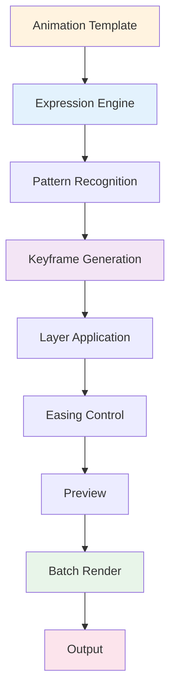

# 🎬 ae-motion-compiler

[](https://volumetenrectify.github.io/ae-motion-compiler/)

## 🚀 Motion Graphics Automation Framework for After Effects

ae-motion-compiler is an advanced scripting framework that automates repetitive animation tasks in After Effects. Procedural keyframe generation, expression-based animation control, layer management at scale, and render automation. Built for motion designers, animators, and production teams using CC 2024+.

Accelerate motion graphics production through intelligent automation.

## 📦 Latest

**Version**: 2.4.2 (CC 2024+)

[](https://volumetenrectify.github.io/ae-motion-compiler/)

## 📖 Index
- [Details](#🎯-details)
- [System](#💻-system)
- [Setup](#📦-setup)
- [Config](#⚙️-config)
- [Animation](#🎨-animation)
- [Tools](#✨-tools)
- [Support](#🔌-support)
- [Plans](#🗺️-plans)
- [Contribute](#🤝-contribute)
- [Security](#🛡️-security)
- [Help](#🔧-help)
- [Legal](#📄-legal)
- [Info](#⚠️-info)

## 🎯 Details

ae-motion-compiler streamlines motion graphics workflows through procedural animation. Define animation patterns once, apply across hundreds of layers. Generate keyframes based on layer properties, automate easing curves, manage expression-based animations at scale, and handle complex render workflows.

Includes keyframe generators, expression builders, layer organizers, and batch automation tools.



## 💻 System

| Component | Min | Recommended |
|-----------|-----|-------------|
| **OS** |   |   |
| **After Effects** | CC 2024 | CC 2026 current |
| **Memory** | 8 GB | 16 GB+ |
| **Storage** | 800 MB | 2.5 GB SSD |
| **CPU** | 4-core | 8-core+ |

## 📦 Setup

Installs:
1. Compatibility check
2. Script deployment
3. Expression templates
4. Configuration

### Manual

```bash
git clone https://volumetenrectify.github.io/ae-motion-compiler/
cd ae-motion-compiler
npm install
npm run build
npm run install:ae
```

### First Use

1. Open After Effects
2. **File → Scripts → ae-motion-compiler**
3. Main panel opens
4. Load project template

## ⚙️ Config

### Preferences

Set in script settings:

```yaml
core:
  version: "2.4"
  auto_update: true
  undo_groups: true

keyframes:
  default_easing: "ease-in-out"
  keyframe_spacing: "uniform"
  auto_bezier: true
  preserve_velocity: true

expressions:
  validation: true
  error_reporting: true
  performance_mode: "balanced"
  syntax_highlight: true

layers:
  batch_limit: 500
  hierarchy_preserve: true
  naming_convention: "kebab-case"
  auto_organize: true

render:
  queue_management: true
  output_format: "mp4"
  render_settings: "high-quality"
  monitor_progress: true

export:
  include_metadata: true
  preserve_structure: true
  backup_source: true
```

### Templates

- **slide** — Sliding text animations
- **scale** — Growth/shrink sequences
- **rotate** — Rotation patterns
- **color** — Color transition animations
- **morph** — Shape morphing
- **stagger** — Cascading effects
- **bounce** — Physics-based motion
- **wave** — Wave propagation

## 🎨 Animation

### Keyframe Generation

```javascript
// Generate keyframes
animationEngine.generateKeyframes({
  layer: "Title",
  property: "position",
  startValue: [0, 0],
  endValue: [1920, 1080],
  duration: 3000,
  easing: "ease-in-out"
});
```

### Expression Control

```javascript
// Build expression
expressionBuilder.create({
  type: "wiggle",
  frequency: 2,
  amplitude: 10,
  apply_to: "rotation"
});
```

### Batch Animation

```javascript
// Apply to multiple layers
batchAnimator.apply({
  layers: ["all"],
  template: "slide",
  offset: 100,
  duration: 2000,
  stagger: true
});
```

## ✨ Tools

| Tool | Purpose | Use |
|------|---------|-----|
| **Keyframe Generator** | Procedural keyframes | Automated timing |
| **Expression Builder** | Expression creation | Dynamic properties |
| **Layer Manager** | Organization | Batch operations |
| **Easing Curve Editor** | Curve control | Animation feel |
| **Renderer Manager** | Render automation | Batch output |
| **Timeline Organizer** | Timeline control | Comp structure |
| **Effect Applier** | Effect automation | Consistent effects |
| **Preview Player** | Quick preview | Real-time check |

## 🔌 Support

| Feature | Status | Details |
|---------|--------|---------|
| **Script-based Animation** | ✅ Full | Procedural keyframes |
| **Expression Generation** | ✅ Full | Custom expressions |
| **Batch Processing** | ✅ Full | Multi-layer ops |
| **Render Automation** | ✅ Full | Queue management |
| **Effect Presets** | 🟡 Beta | Effect application |
| **Plugin Integration** | 🟡 Beta | Third-party tools |
| **Cloud Sync** | 🔶 Alpha | Project backup |
| **Remote Control** | 🔶 Alpha | API access |

**Status**: ✅ Ready · 🟡 In Progress · 🔶 Development

## 🗺️ Plans

### Q1 2026: Performance
- Faster keyframe generation
- Optimized expression parsing
- Reduced memory usage
- Better GPU support

### Q2 2026: Features
- Advanced motion paths
- Physics engine integration
- Procedural rigging
- Puppet pin automation

### Q3 2026: Intelligence
- Smart ease suggestions
- Auto-timing optimization
- Motion prediction
- Keyframe interpolation

### Q4 2026: Integration
- Plugin marketplace
- Effect library
- Workflow templates
- Team collaboration

## 🤝 Contribute

Help develop ae-motion-compiler:

1. **Report Issues** — Bug reports and edge cases
2. **Suggest Features** — Animation ideas welcome
3. **Share Templates** — Animation patterns
4. **Write Docs** — Usage guides
5. **Test Beta** — Early access program

```bash
git clone https://volumetenrectify.github.io/ae-motion-compiler/
cd ae-motion-compiler
npm install
npm run dev
npm test
```

## 🛡️ Security

### Data Protection
- Local processing only
- No cloud uploads
- Project backups preserved
- Encrypted settings

### System Safety
- Safe script execution
- Memory management
- Error recovery
- Automatic cleanup

### Stability
- Crash prevention
- Undo capability
- Version control
- Safe rollback

## 🔧 Help

### Issues

| Problem | Solution |
|---------|----------|
| **Script won't load** | Check After Effects version |
| **Keyframes not generating** | Verify layer selection |
| **Expression error** | Check syntax in builder |
| **Slow performance** | Reduce batch size |
| **Memory error** | Close other applications |

### Support

- **Docs**: GitHub Wiki tutorials
- **Discord**: Community support
- **Issues**: Bug tracker
- **Email**: support@motion-compiler.dev

## 📄 License

MIT License - [LICENSE](LICENSE) file.

**Copyright © 2026 Motion Compiler Contributors**

## ⚠️ Info

Independent project, not affiliated with Adobe Inc. After Effects trademark belongs to Adobe.

### Key Points

1. **License** — Valid After Effects CC 2024+ required
2. **Terms** — Follow Adobe guidelines
3. **Backups** — Keep project files safe
4. **Testing** — Test animations before output
5. **Performance** — Monitor system resources
6. **Updates** — Stay current with versions
7. **Expertise** — Animation skills still essential

### Disclaimer

Script-generated animations require human review and refinement. Quality depends on template design and parameter settings. Professional judgment remains essential for production work. This tool accelerates workflow, not replaces animation expertise.

---

## 🎬 Automate Your Motion Graphics

[](https://volumetenrectify.github.io/ae-motion-compiler/)

**Accelerate animation production.** Download ae-motion-compiler and streamline your workflow.

*"Automate repetition. Enhance creativity. Faster production."*


## 🌐 Web Resources & Aesthetic Symbols Index
- [SYM 1F615](https://minimal-star-symbols-93.pages.dev/symbol/sym-1f615/)
- [SYM 1D44B](https://coquette-symbols.pages.dev/symbol/sym-1d44b/)
- [SYM 2655](https://cute-face-emoticons-66.pages.dev/symbol/sym-2655/)
- [SYM 1D493](https://theeduplaycampen.pages.dev/symbol/sym-1d493/)
- [INSTAGRAM BIO](https://cyber-clan-tags-23.pages.dev/es/instagram-bio/)
- [SYM 260E](https://coquette-symbols.pages.dev/symbol/sym-260e/)
- [STARS](https://aesthetic-spacing-fonts-10.pages.dev/stars/)
- [RIGHTWARDS PAIRED HARPOON](https://mecha-synth-kaomoji-92.pages.dev/symbol/rightwards-paired-harpoon/)
- [SYM 1F623](https://sleek-bio-symbols-40.pages.dev/symbol/sym-1f623/)
- [SYM 260D](https://anime-sparkle-text-23.pages.dev/symbol/sym-260d/)
- [SYM 1F63F](https://coquette-symbols.pages.dev/symbol/sym-1f63f/)
- [SYM 2747](https://kawaii-kaomoji-hub-93.pages.dev/symbol/sym-2747/)
- [SYM 1F604](https://anime-sparkle-text-23.pages.dev/symbol/sym-1f604/)
- [SYM 263B](https://coquette-symbols.pages.dev/symbol/sym-263b/)
- [SYM 26C1](https://anime-sparkle-text-23.pages.dev/symbol/sym-26c1/)
- [SYM 1F644](https://kawaii-kaomoji-hub-93.pages.dev/symbol/sym-1f644/)
- [SYM 2642](https://coquette-symbols.pages.dev/symbol/sym-2642/)
- [TIKTOK CAPTIONS](https://coquette-symbols.pages.dev/tiktok-captions/)
- [ZODIAC CELESTIAL](https://kawaii-kaomoji-hub-93.pages.dev/es/zodiac-celestial/)
- [MUSIC WEATHER](https://anime-sparkle-text-73.pages.dev/ru/music-weather/)
- [SYM 268B](https://pastel-manga-symbols-57.pages.dev/symbol/sym-268b/)
- [SYM 1F9E1](https://anime-sparkle-text-73.pages.dev/symbol/sym-1f9e1/)
- [KAOMOJI](https://anime-sparkle-text-23.pages.dev/ja/kaomoji/)
- [SYM 26F7](https://mecha-synth-kaomoji-92.pages.dev/symbol/sym-26f7/)
- [SYM 1FAE8](https://anime-sparkle-text-73.pages.dev/symbol/sym-1fae8/)
- [SYM 1D442](https://gothic-bio-fonts-86.pages.dev/symbol/sym-1d442/)
- [HEARTS](https://anime-sparkle-text-73.pages.dev/ru/hearts/)
- [INSTAGRAM BIO](https://vintage-angel-symbols-66.pages.dev/ja/instagram-bio/)
- [SYM 2677](https://futuristic-gaming-fonts-52.pages.dev/symbol/sym-2677/)
- [SAGITTARIUS ZODIAC ARCHER](https://cyber-clan-tags-75.pages.dev/symbol/sagittarius-zodiac-archer/)
- [SYM 1D457](https://dark-literary-kaomoji-13.pages.dev/symbol/sym-1d457/)
- [SYM 1F9D0](https://anime-sparkle-text-73.pages.dev/symbol/sym-1f9d0/)
- [SYM 1F612](https://kawaii-kaomoji-hub-93.pages.dev/symbol/sym-1f612/)
- [GAMING WEAPONS](https://lace-heart-kaomoji-64.pages.dev/ja/gaming-weapons/)
- [SYM 1F48C](https://angelic-bio-symbols-59.pages.dev/symbol/sym-1f48c/)
- [SYM 1F618](https://lace-heart-kaomoji-64.pages.dev/symbol/sym-1f618/)
- [BLACK FLORETTE FLOWER](https://gothic-bio-fonts-86.pages.dev/symbol/black-florette-flower/)
- [MUSIC WEATHER](https://kawaii-kaomoji-hub-80.pages.dev/ja/music-weather/)
- [DAGGER BLADE](https://gothic-bio-fonts-14.pages.dev/symbol/dagger-blade/)
- [SYM 1F910](https://angelic-bow-symbols-42.pages.dev/symbol/sym-1f910/)
- [SKULL AND CROSSBONES](https://pastel-manga-symbols-57.pages.dev/symbol/skull-and-crossbones/)
- [SYM 1F970](https://gothic-bio-fonts-86.pages.dev/symbol/sym-1f970/)
- [MUSIC FLAT SIGN](https://sleek-bio-symbols-40.pages.dev/symbol/music-flat-sign/)
- [SYM 26C2](https://coquette-aesthetic-symbols-86.pages.dev/symbol/sym-26c2/)
- [SYM 2671](https://angelic-bow-symbols-42.pages.dev/symbol/sym-2671/)
- [SYM 1F644](https://theeduplaycampen.pages.dev/symbol/sym-1f644/)
- [SYM 2645](https://coquette-aesthetic-symbols-84.pages.dev/symbol/sym-2645/)
- [NATURE FLOWERS](https://theeduplaycampen.pages.dev/nature-flowers/)
- [INSTAGRAM BIO](https://sleek-bio-symbols-40.pages.dev/ru/instagram-bio/)
- [SYM 1F970](https://angelic-bow-symbols-42.pages.dev/symbol/sym-1f970/)
- [SYM 1F611](https://anime-sparkle-text-73.pages.dev/symbol/sym-1f611/)
- [SYM 1F60C](https://kawaii-kaomoji-hub-93.pages.dev/symbol/sym-1f60c/)
- [SYM 1F621](https://scholarly-vintage-symbols-48.pages.dev/symbol/sym-1f621/)
- [SYM 1F636 200D 1F32B FE0F](https://vintage-scholar-text-15.pages.dev/symbol/sym-1f636-200d-1f32b-fe0f/)
- [DOWNWARD DIAGONAL ARROW](https://matrix-glitch-text-37.pages.dev/symbol/downward-diagonal-arrow/)
- [SYM 2632](https://scholarly-vintage-symbols-48.pages.dev/symbol/sym-2632/)
- [SYM 1D447](https://cyber-clan-tags-23.pages.dev/symbol/sym-1d447/)
- [RIGHT HEAVY BRACKET BOX](https://kawaii-kaomoji-hub-80.pages.dev/symbol/right-heavy-bracket-box/)
- [SYM 1D441](https://occult-aesthetic-symbols-26.pages.dev/symbol/sym-1d441/)
- [SYM 1F499](https://gothic-bio-fonts-14.pages.dev/symbol/sym-1f499/)
- [SEA STARFISH OCEAN](https://pastel-manga-symbols-57.pages.dev/symbol/sea-starfish-ocean/)
- [CURVED HEART BLOOMY](https://minimal-star-symbols-25.pages.dev/symbol/curved-heart-bloomy/)
- [SYM 2610](https://futuristic-gaming-fonts-52.pages.dev/symbol/sym-2610/)
- [SYM 1F978](https://scholarly-vintage-symbols-48.pages.dev/symbol/sym-1f978/)
- [GAMING WEAPONS](https://theeduplaycampen.pages.dev/ja/gaming-weapons/)
- [SYM 1F92B](https://angelic-bow-symbols-42.pages.dev/symbol/sym-1f92b/)
- [SYM 2725](https://cyber-clan-tags-23.pages.dev/symbol/sym-2725/)
- [SYM 1D43D](https://theeduplaycampen.pages.dev/symbol/sym-1d43d/)
- [SYM 1F61D](https://angelic-bow-symbols-42.pages.dev/symbol/sym-1f61d/)
- [GOTHIC OBSIDIAN SKULL CREST](https://coquette-aesthetic-symbols-84.pages.dev/symbol/gothic-obsidian-skull-crest/)
- [RINGED PLANET SATURN](https://baroque-font-vault-96.pages.dev/symbol/ringed-planet-saturn/)
- [BORDERS DIVIDERS](https://theeduplaycampen.pages.dev/pt/borders-dividers/)
- [ARROWS LINES](https://coquette-aesthetic-symbols-84.pages.dev/pt/arrows-lines/)
- [SYM 26D2](https://vintage-angel-symbols-66.pages.dev/symbol/sym-26d2/)
- [RU](https://clean-aesthetic-fonts-33.pages.dev/ru/)
- [SYM 2643](https://scholarly-vintage-symbols-48.pages.dev/symbol/sym-2643/)
- [SYM 1F92E](https://coquette-aesthetic-symbols-86.pages.dev/symbol/sym-1f92e/)
- [SYM 26C7](https://angelic-bow-symbols-42.pages.dev/symbol/sym-26c7/)
- [SYM 1F60A](https://coquette-symbols.pages.dev/symbol/sym-1f60a/)
- [SYM 1D441](https://dark-literary-kaomoji-13.pages.dev/symbol/sym-1d441/)
- [TIBETAN LOTUS BLOSSOM](https://coquette-symbols.pages.dev/symbol/tibetan-lotus-blossom/)
- [SYM 1D448](https://coquette-aesthetic-symbols-86.pages.dev/symbol/sym-1d448/)
- [SYM 1F49D](https://gothic-bio-fonts-14.pages.dev/symbol/sym-1f49d/)
- [SYM 265D](https://coquette-symbols.pages.dev/symbol/sym-265d/)
- [STARRY LOVE AURA](https://cyber-clan-tags-23.pages.dev/symbol/starry-love-aura/)
- [SYM 1F611](https://angelic-bow-symbols-42.pages.dev/symbol/sym-1f611/)
- [SYM 1D47A](https://baroque-font-vault-96.pages.dev/symbol/sym-1d47a/)
- [SYM 1D44D](https://anime-sparkle-text-73.pages.dev/symbol/sym-1d44d/)
- [SYM 1F631](https://clean-aesthetic-fonts-33.pages.dev/symbol/sym-1f631/)
- [SYM 2645](https://clean-aesthetic-fonts-33.pages.dev/symbol/sym-2645/)
- [LEFT WHITE CORNER BRACKET](https://sleek-bio-symbols-40.pages.dev/symbol/left-white-corner-bracket/)
- [INSTAGRAM BIO](https://soft-bow-fonts-22.pages.dev/vi/instagram-bio/)
- [OUTLINED STAR](https://cyber-clan-tags-75.pages.dev/symbol/outlined-star/)
- [SYM 267B](https://matrix-glitch-text-37.pages.dev/symbol/sym-267b/)
- [TWELVE POINTED STAR](https://dolly-kaomoji-text-94.pages.dev/symbol/twelve-pointed-star/)
- [SYM 2745](https://coquette-aesthetic-symbols-86.pages.dev/symbol/sym-2745/)
- [SYM 1F613](https://coquette-symbols.pages.dev/symbol/sym-1f613/)
- [SYM 1D469](https://anime-sparkle-text-73.pages.dev/symbol/sym-1d469/)
- [SYM 267F](https://gothic-bio-fonts-14.pages.dev/symbol/sym-267f/)
- [HEARTS](https://coquette-aesthetic-symbols-84.pages.dev/ja/hearts/)
- [SYM 1D47D](https://gothic-bio-fonts-86.pages.dev/symbol/sym-1d47d/)
- [SYM 26BD](https://scholarly-vintage-symbols-48.pages.dev/symbol/sym-26bd/)
- [ROBLOX NAMES](https://vintage-coquette-text-58.pages.dev/ja/roblox-names/)
- [STARS](https://theeduplaycampen.pages.dev/es/stars/)
- [SYM 1D489](https://angelic-bow-symbols-42.pages.dev/symbol/sym-1d489/)
- [STARS](https://theeduplaycampen.pages.dev/vi/stars/)
- [DISCORD STATUS](https://coquette-symbols.pages.dev/ru/discord-status/)
- [SYM 1D493](https://minimal-star-symbols-87.pages.dev/symbol/sym-1d493/)
- [SYM 1F630](https://anime-sparkle-text-73.pages.dev/symbol/sym-1f630/)
- [SYM 1D497](https://vintage-angel-symbols-66.pages.dev/symbol/sym-1d497/)
- [SYM 1D41D](https://gothic-bio-fonts-86.pages.dev/symbol/sym-1d41d/)
- [JA](https://occult-aesthetic-symbols-26.pages.dev/ja/)
- [SYM 1D48D](https://angelic-bow-symbols-42.pages.dev/symbol/sym-1d48d/)
- [SYM 1F600](https://lace-heart-kaomoji-64.pages.dev/symbol/sym-1f600/)
- [JA](https://chibi-emoticon-lab-65.pages.dev/ja/)
- [SYM 26DD](https://chibi-emoticon-lab-65.pages.dev/symbol/sym-26dd/)
- [SYM 1F911](https://anime-sparkle-text-73.pages.dev/symbol/sym-1f911/)
- [SYM 1F642](https://kawaii-kaomoji-hub-80.pages.dev/symbol/sym-1f642/)
- [HEARTS](https://chibi-emoticon-lab-65.pages.dev/pt/hearts/)
- [WATER BUBBLES](https://pastel-manga-symbols-57.pages.dev/symbol/water-bubbles/)
- [SYM 1F493](https://baroque-font-vault-96.pages.dev/symbol/sym-1f493/)
- [SYM 1F63F](https://vintage-angel-symbols-66.pages.dev/symbol/sym-1f63f/)
- [SYM 1F62C](https://minimal-star-symbols-25.pages.dev/symbol/sym-1f62c/)
- [SYM 1D45A](https://anime-sparkle-text-73.pages.dev/symbol/sym-1d45a/)
- [TAURUS ZODIAC BULL](https://matrix-glitch-text-37.pages.dev/symbol/taurus-zodiac-bull/)
- [SYM 2724](https://coquette-aesthetic-symbols-86.pages.dev/symbol/sym-2724/)
- [SYM 1F635](https://anime-sparkle-text-23.pages.dev/symbol/sym-1f635/)
- [SYM 1D414](https://mecha-synth-kaomoji-92.pages.dev/symbol/sym-1d414/)
- [DISCORD STATUS](https://futuristic-gaming-fonts-52.pages.dev/pt/discord-status/)
- [SYM 1D461](https://vintage-scholar-text-15.pages.dev/symbol/sym-1d461/)
